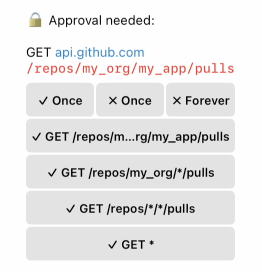
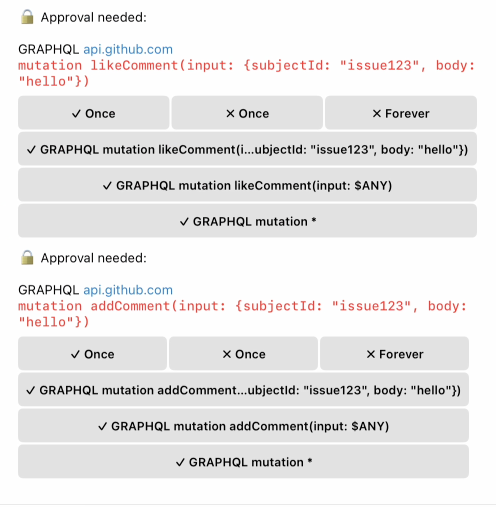

# http-proxy

HTTPS MITM proxy with Telegram approval flow.

- HTTP/GraphQL mode: intercepts requests carrying fake secrets and asks for approval before substituting and forwarding.
- Git mode: intercepts Git smart-HTTP traffic for configured hosts (for example `github.com`), asks for clone/fetch/push approval, and syncs local bare repos with upstream via SSH.

Uses glob-based pattern matching for both HTTP and GraphQL requests to permanently grant or reject request patterns.

## Setup

### 1. Install dependencies

```bash
bun install
```

### 2. Generate CA certificate

```bash
bun run generate-certs.ts
```

This creates:

- `certs/ca.crt` - CA certificate (install this in your VM/system)

Per-domain certificates are generated automatically when the proxy starts, based on hosts in `proxy-config.json`. They are stored in `certs/domains/`.

### 3. Install CA certificate in your VM

Copy `certs/ca.crt` to your VM and install it as a trusted root CA.

For Colima/Lima VMs:

```bash
# Copy cert to VM
limactl copy certs/ca.crt colima:/tmp/ca.crt

# SSH into VM and install
limactl shell colima
sudo cp /tmp/ca.crt /usr/local/share/ca-certificates/vm-proxy-ca.crt
sudo update-ca-certificates
```

### 4. Configure environment variables

Create a `.env` file:

```bash
TELEGRAM_API_TOKEN=your_bot_token
TELEGRAM_OWNER_ID=your_telegram_user_id
GH_TOKEN=your_actual_github_token
# Add other real secrets as needed
```

### 5. Configure proxy hosts

Edit `proxy-config.json` to add hosts you want to intercept.

If you use both GitHub API and Git traffic, configure both:

- `api.github.com` (HTTP/GraphQL secrets flow)
- `github.com` (git smart-HTTP flow under `git` config)

See [Configuration](#configuration) below for the full format.

### 6. Configure /etc/hosts in your machine/VM

Point every configured host to the proxy IP. For local development this is typically `127.0.0.1`:

```bash
# /etc/hosts
127.0.0.1 api.github.com
127.0.0.1 github.com
```

If the proxy runs on a different machine/container, use that machine's IP instead.

### 7. Run the proxy

```bash
bun run index.ts
```

Or with auto-reload:

```bash
bun --watch run index.ts
```

The proxy listens on:

- Port 80 (HTTP)
- Port 443 (HTTPS)

## How it works (HTTP/GraphQL secret flow)

1. Request arrives at proxy
2. Scans all header values for the host's fake secret
3. **If secret NOT found** - Pass through to upstream as-is
4. **If secret found**:
   - Check rejections first (checked before grants for safety)
   - Check grants
   - If permanently rejected - return 403
   - If permanently granted - substitute fake→real secret, forward
   - Otherwise - send Telegram message with inline keyboard for approval
   - Hold request until user responds (~4 min timeout → 403)
   - If approved: substitute secret, forward to upstream
   - If rejected: return 403

## How it works (Git flow)

For hosts with a `git` config section, git smart-HTTP paths are routed to the git handler:

- clone/fetch discovery and data (`git-upload-pack`)
- push discovery and data (`git-receive-pack`)

Flow summary:

1. Parse `owner/repo` from request URL (`/owner/repo.git/...` or `/owner/repo/...`).
2. If repo is unknown and operation is clone/fetch, send Telegram approval:
   - `✓ Allow forever` persists repo config and initializes local bare repo.
   - `✗ Reject once` returns 403.
3. Sync local bare repo from upstream before serving reads.
4. Pushes run pre-receive validation + approvals:
   - protected paths are rejected immediately (no Telegram)
   - tag push: one-time approval only
   - branch deletion: one-time approval only
   - force push: one-time approval only
   - normal branch push: can be approved once or persisted as branch/pattern grant/rejection
5. Approved pushes are forwarded from proxy bare repo to upstream via SSH.

## Configuration

`proxy-config.json` maps hostnames to their configuration:

```json
{
  "api.github.com": {
    "graphqlEndpoints": ["/graphql"],
    "openApiSpec": {
      "url": "https://raw.githubusercontent.com/github/rest-api-description/main/descriptions/api.github.com/api.github.com.yaml"
    },
    "secrets": [
      {
        "secret": "fake_token_used_in_vm",
        "secretEnvVarName": "GH_TOKEN",
        "grants": [
          "GET /repos/*/*/actions/runs",
          "GRAPHQL query repository(owner: $ANY, name: $ANY)"
        ],
        "rejections": []
      }
    ]
  },
  "github.com": {
    "secrets": [],
    "git": {
      "ssh_key_path": "/run/secrets/github-deploy-key",
      "repos_dir": "./git-repos",
      "repos": {
        "owner/repo": {
          "upstream": "git@github.com:owner/repo.git",
          "base_branch": "main",
          "allowed_push_branches": ["agent/*"],
          "rejected_push_branches": ["main"],
          "protected_paths": [".github/**", "*.nix"]
        }
      }
    }
  }
}
```

| Field                                     | Description                                                     |
| ----------------------------------------- | --------------------------------------------------------------- |
| `secrets[].secret`                        | The fake token your VM uses in requests                         |
| `secrets[].secretEnvVarName`              | Env var containing the real token                               |
| `secrets[].grants`                        | Patterns for permanently allowed requests                       |
| `secrets[].rejections`                    | Patterns for permanently blocked requests                       |
| `graphqlEndpoints`                        | Paths treated as GraphQL endpoints (e.g. `["/graphql"]`)        |
| `openApiSpec.url`                         | URL to fetch an OpenAPI spec from (cached in `.openapi-cache/`) |
| `openApiSpec.path`                        | Local file path to an OpenAPI spec                              |
| `git.ssh_key_path`                        | Optional SSH key path used for upstream fetch/push              |
| `git.repos_dir`                           | Directory for local bare repos and hook socket                  |
| `git.repos.<owner/repo>.upstream`         | Upstream SSH remote for that repo                               |
| `git.repos.<owner/repo>.base_branch`      | Base/default branch (used for HEAD + branch safety options)     |
| `git.repos.<owner/repo>.allowed_push_branches`  | Persisted allowed branch patterns                               |
| `git.repos.<owner/repo>.rejected_push_branches` | Persisted rejected branch patterns                              |
| `git.repos.<owner/repo>.protected_paths`  | Protected glob paths (immediate reject, no Telegram)            |

## HTTP pattern matching

HTTP request patterns have the format `METHOD /path`. Query parameters are stripped before matching.

### Exact match

```
"GET /api/v2/users/me"
```

Matches only `GET /api/v2/users/me`.

### Single-segment wildcard (`*`)

`*` matches exactly one path segment (anything except `/`). Uses `Bun.Glob` internally.

```
"GET /repos/*/actions"
```

- Matches: `GET /repos/myrepo/actions`
- Does NOT match: `GET /repos/a/b/actions` (multiple segments)

### Multiple wildcards

```
"GET /repos/*/*/actions/runs/*/jobs"
```

Matches: `GET /repos/owner/repo/actions/runs/123/jobs`

### Catch-all

```
"GET *"
```

Matches any `GET` request regardless of path. The method must still match exactly.

## GraphQL pattern matching

GraphQL requests are parsed to extract top-level fields with their arguments. Each field is matched independently with its own pattern.

Request keys have the format `GRAPHQL [query|mutation] fieldName(arg: value, ...)`.

### Simple field (no arguments)

```
"GRAPHQL query viewer"
```

Matches a query that selects the `viewer` field with no arguments.

### Field with exact arguments

```
"GRAPHQL query repository(owner: \"foo\", name: \"bar\")"
```

Matches only when both argument values match exactly.

### `$ANY` wildcard

`$ANY` matches any value in that argument position.

```
"GRAPHQL query repository(owner: $ANY, name: $ANY)"
```

Matches `repository` with any `owner` and `name` values.

### `$ANY` in nested objects

```
"GRAPHQL mutation createPullRequest(input: $ANY)"
```

Matches with any `input` object, regardless of its fields.

`$ANY` can also be used for specific fields within an object:

```
"GRAPHQL mutation createPullRequest(input: {branch: \"main\", title: $ANY})"
```

Matches only when `branch` is `"main"`, but allows any `title`.

### Catch-all by operation type

```
"GRAPHQL query *"
"GRAPHQL mutation *"
```

Matches any query or any mutation, respectively.

### Argument matching rules

- Field names must match exactly
- Argument counts must match exactly
- Each pattern argument must exist in the request (matched by name)
- `$ANY` matches any value (scalars, objects, lists)
- All other values must match exactly (same type, same value)
- Only `$ANY` is supported as a variable; other variable names throw an error

## Pattern suggestions

When a request needs approval, the Telegram message includes buttons with progressively broader patterns to grant/reject. Patterns are generated from most specific (exact match) to least specific (catch-all).

### HTTP pattern suggestions (OpenAPI-aware)

When an `openApiSpec` is configured, the proxy matches the request path against OpenAPI templates to identify which segments are parameters. Wildcards are substituted from right to left:

```
Request: GET /repos/owner/repo/actions/runs/123/jobs
OpenAPI template: /repos/{owner}/{repo}/actions/runs/{run_id}/jobs

Suggested patterns:
  GET /repos/owner/repo/actions/runs/123/jobs   (exact)
  GET /repos/owner/repo/actions/runs/*/jobs      (run_id wildcarded)
  GET /repos/owner/*/actions/runs/*/jobs          (repo + run_id)
  GET /repos/*/*/actions/runs/*/jobs              (all params wildcarded)
  GET *                                           (catch-all)
```

Without an OpenAPI spec, only the exact match and catch-all are suggested.

### GraphQL pattern suggestions

For fields with arguments, `$ANY` is substituted from right to left:

```
Field: createPullRequest(repositoryId: "abc", title: "foo", body: "bar")

Suggested patterns:
  GRAPHQL mutation createPullRequest(repositoryId: "abc", title: "foo", body: "bar")
  GRAPHQL mutation createPullRequest(repositoryId: "abc", title: "foo", body: $ANY)
  GRAPHQL mutation createPullRequest(repositoryId: "abc", title: $ANY, body: $ANY)
  GRAPHQL mutation createPullRequest(repositoryId: $ANY, title: $ANY, body: $ANY)
  GRAPHQL mutation *
```

## Parallel GraphQL field approval

When a GraphQL request contains multiple top-level fields that need approval, approval is requested for each field **in parallel** as separate Telegram messages.

- If **any** field is rejected, all remaining pending approvals for that request are cancelled immediately
- If the client disconnects, all pending approvals are cancelled and Telegram messages are updated to show the disconnection
- The request is only forwarded if **all** fields are approved

## Telegram approval flow

When a request needs approval, you receive a Telegram message with these buttons:

### HTTP with openapi



### Graphql

 |

- **✓ Once** - Allow this specific request once
- **✗ Once** - Reject this specific request once
- **✗ Forever** - Expands to show pattern options for permanent rejection
- **✓ \<pattern\>** - Allow forever using the shown pattern (saves to `grants` in config)

### Git approval variants

- **Clone/fetch unknown repo**: `✓ Allow forever` / `✗ Reject once`
- **Branch push**: `✓ Once`, `✗ Once`, `✗ Forever ▸`, and pattern grants like `✓ agent/*`, `✓ * (except main)`, `✓ *`
- **Tag push**: one-time approval only (`✓ Once` / `✗ Once`)
- **Branch deletion**: one-time approval only (`✓ Once` / `✗ Once`)
- **Force push**: one-time approval only (`✓ Once` / `✗ Once`)

"Forever" choices persist to `proxy-config.json` (`secrets[].grants/rejections` for HTTP/GraphQL, `git.repos.*.allowed_push_branches/rejected_push_branches` for git).

Requests time out after ~4 minutes (255s, Bun's max `idleTimeout`) and are auto-rejected.

## Telegram commands

- `/start` - Start the bot
- `/help` - Show help
